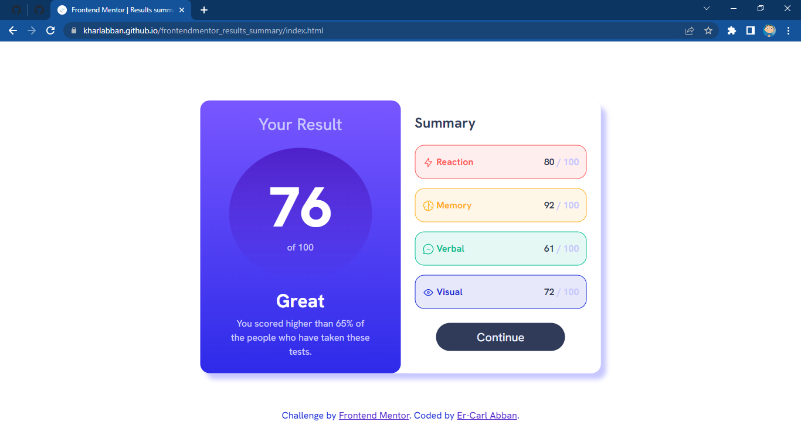

# Frontend Mentor - Results summary component solution

This is a solution to the [Results summary component challenge on Frontend Mentor](https://www.frontendmentor.io/challenges/results-summary-component-CE_K6s0maV). Frontend Mentor challenges help you improve your coding skills by building realistic projects.

## Table of contents

- [Overview](#overview)
  - [The challenge](#the-challenge)
  - [Screenshot](#screenshot)
  - [Links](#links)
- [My process](#my-process)
  - [Built with](#built-with)
  - [What I learned](#what-i-learned)
  - [Continued development](#continued-development)
  - [Useful resources](#useful-resources)
- [Author](#author)
- [Acknowledgments](#acknowledgments)

## Overview

### The challenge

Users should be able to:

- View the optimal layout for the interface depending on their device's screen size
- See hover and focus states for all interactive elements on the page

### Screenshot

### Links

- Solution URL: [Add solution URL here](https://your-solution-url.com)
- Live Site URL: [Add live site URL here](https://your-live-site-url.com)

## My process

### Built with

- Semantic HTML5 markup
- CSS custom properties
- Flexbox
- CSS Grid
- Mobile-first workflow
- [Bootstrap 5](https://getbootstrap.com) - CSS Framework

### Continued development

The main issue here is littered code. Working on simplifying it.

**Note: Delete this note and the content within this section and replace with your own plans for continued development.**

### Useful resources

- [Bootstrap 5](https://www.getbootstrap.com) - This CSS framework is amazing. It virtuallydoesall the styling and grid work for you. Check it out!
- [W3Schools](https://www.w3schools.com) - This is an amazing article which helped me throughout with helpful CSS tips, best practices, and examples.

## Author

- Frontend Mentor - [@KharlAbban](https://www.frontendmentor.io/profile/KharlAbban)
- Github - [KharlAbban](https://www.github.com/KharlAbban)
- LinkedIn - [KharlAbban](https://www.linkedin.com/in/er-carl-abban-623817271/)
